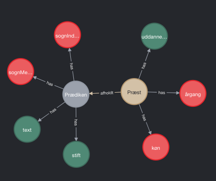

# Danish Sermons
 
This repository present a corpus of 11,955 sermons from the Evangelical Lutheran Church in Denmark (ELCD), which is structured for a relational database. The repository only includes metadata, since the corpus texts contain sensitive personal information.

## Metadata
The corpus metadata is included in the file metadata.csv as a table with the following columns. The labels are composed in Danish.

```
Kolonnenavn             | Beskrivelse
------------------------------------------------------------
dokumentId              | id of the document holding the sermon's text
præstId                 | id of the pastor who wrote the sermon
dato                    | date of the church service
helligdag               | church holiday 
sogn str.               | inhabitants in the parish for which the sermon is composed (ELCD members/total) 
stift                   | name of diocese
årgang                  | the pastor's birth year
køn                     | the pastor's gender
uddannelsessted         | the pastor's place of education

```  

## Data Model
The data has been normalised to avoid ambivalence. In order to resemble the relationship between data points, the columns in the table have been divided between two distinct data models: __Prædiken__ (sermon) og __Præst__ (pastor). The models each describe a data class. The classes and their properties are explicated in the following:

### Sermon
The class __Prædiken__ holds data points about the context for which the sermon is composed. _Præst_ refers to the __Præst__ who composed the sermon. _Dato_ states the date of the church service for which the sermon was composed. _Helligdag_ holds the name of the church holiday for which the sermon was composed. _Stift_ mentions the diocese in which the sermon was delivered. _SognIndbyggere_ states the total number of inhibitants in the parish, where the sermon was delivered, and _SognMedlemmer_ states how many members of the ELCD the parish has. _Text_ contains the sermon in full text.  

```
Prædiken: {
    præst:              <id Præst>,
    dato:               String,
    helligdag:          String,
    stift:              String,
    sognIndbyggere:     Integer,
    sognMedlemmer:      Integer,
    text:               String,
}
```

### Pastor
The class __Præst__ specifies general data about the author of the sermon. _Køn_ classifies the gender of the pastor (1 is male, 2 is female). _Uddannelsessted_ mentions the city in which the pastor received his or her theological degree. _Årgang_ includes the birth year of the pastor. 
```
Præst: {
    køn:                Integer,
    uddannelsesSted:    String,
    årgang:             Integer,
}
```

## Data Graph
The graph for the models and their relations is shown below. Integers are represented in red, strings in green and the data classes are distinguished in color


